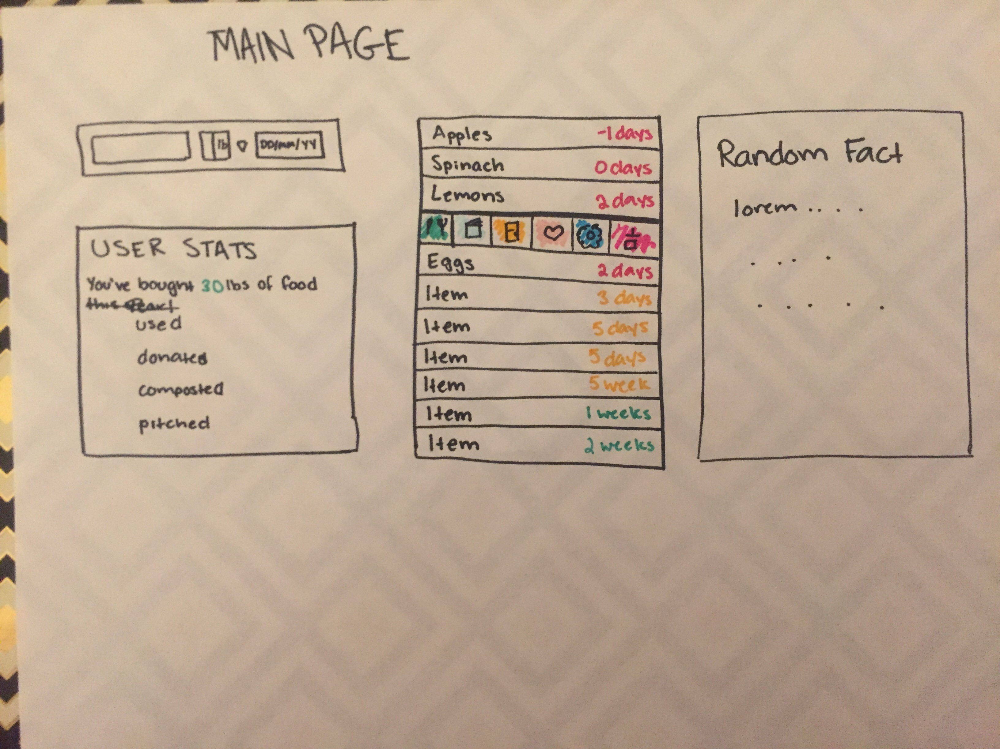

# doc-diplodocus
Group Name: Diplodocus
Members: Kim

Project Description: 
According to a 2017 study by the Natural Resources Defense Council, Inc., “America throws out more than 400 pounds of food per person per year ... And when that food is wasted, so are the resources that go into producing it, including 21 percent of freshwater used by the U.S. agricultural industry. Wasted food also generates climate change pollution equivalent to 37 million cars per year.” That being said, food insecurity is still a major problem and this provides users a way to learn about donating perishable items. This web application's purpose is to combat this waste by giving users a "one-stop shop" to more closely manage their perishable items. Users can input their food items and the application will track their expiration dates as well as track how much they are using versus wasting. Users can find recipes based on what's in their fridge in order to use them up, learn how to prepare items for the freezer or for canning, where to donate their perishables, where to drop off their compost, and finally, a way to indicate they threw away their items. 

APIs: Googlemaps, Recipe, others to be determined

